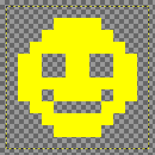
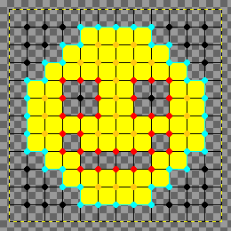
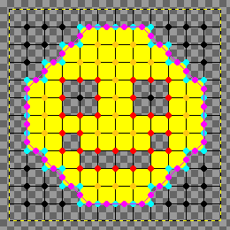
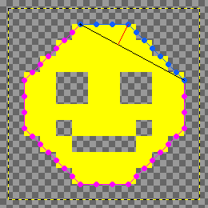
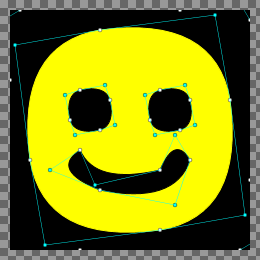

# imagetracerjava


Simple raster image tracer and vectorizer written in Java for desktop. See https://github.com/jankovicsandras/imagetracerandroid for the Android version.

by András Jankovics 2015

This is a port of imagetracer.js: https://github.com/jankovicsandras/imagetracerjs

### Running as a standalone program 

Warning: if the outfilename parameter is not specified, then this will overwrite <filename>.svg .

Basic usage: 
```
java -jar ImageTracer.jar <filename>
```

With options:
```
java -jar ImageTracer.jar <filename> outfilename output.svg ltres 1 qtres 1 pathomit 8 numberofcolors 16 mincolorratio 0.02 colorquantcycles 3 scale 1 lcpr 0 qcpr 0
```

### Including in Java projects
Add ImageTracer.jar to your build path, import, then use the static methods:
```
import jankovicsandras.imagetracer.ImageTracer;

...

ImageTracer.saveString("output.svg",
				ImageTracer.imageToSVG("input.jpg",null,null)
		      );
```

With options and palette
```
// Options
HashMap<String,Float> options = new HashMap<String,Float>();

// Tracing
options.put("ltres",1f);
options.put("qtres",1f);
options.put("pathomit",8f);

// Color quantization
options.put("numberofcolors",16f);
options.put("mincolorratio",0.02f);
options.put("colorquantcycles",3f);

// SVG rendering
options.put("scale",1f);
options.put("lcpr",0f);
options.put("qcpr",0f);

// Palette
// This is an example of a grayscale palette
// please note that signed byte values [ -128 .. 127 ] will be converted to [ 0 .. 255 ] in the getsvgstring function
byte[][] palette = new byte[8][4];
for(int colorcnt=0; colorcnt < 8; colorcnt++){
	palette[colorcnt][0] = (byte)( -128 + colorcnt * 32); // R
	palette[colorcnt][1] = (byte)( -128 + colorcnt * 32); // G
	palette[colorcnt][2] = (byte)( -128 + colorcnt * 32); // B
	palette[colorcnt][3] = (byte)255; 		      // A
}

ImageTracer.saveString("output.svg",
				ImageTracer.imageToSVG("input.jpg",options,palette)
		      );
```

### Main Functions
|Function name|Arguments|Returns|
|-------------|---------|-------|
|imageToSVG|String filename, HashMap<String,Float> options *(can be null)*, byte [][] palette *(can be null)*|String (SVG content)|
|imageToSVG|BufferedImage image, HashMap<String,Float> options *(can be null)*, byte [][] palette *(can be null)*|String (SVG content)|
|imagedataToSVG|ImageData imgd, HashMap<String,Float> options *(can be null)*, byte [][] palette *(can be null)*|String (SVG content)|
|imageToTracedata|String filename, HashMap<String,Float> options *(can be null)*, byte [][] palette *(can be null)*|IndexedImage (read the source for details)|
|imageToTracedata|BufferedImage image, HashMap<String,Float> options *(can be null)*, byte [][] palette *(can be null)*|IndexedImage (read the source for details)|
|imagedataToTracedata|ImageData imgd, HashMap<String,Float> options *(can be null)*, byte [][] palette *(can be null)*|IndexedImage (read the source for details)|

	
#### Helper Functions
|Function name|Arguments|Returns|
|-------------|---------|-------|
|saveString|String filename, String str|void|
|loadImageData|String filename|ImageData (read the source for details)|
|loadImageData|BufferedImage image|ImageData (read the source for details)|

There are more functions for advanced users, read the source if you are interested. :)
	
### Options
|Option name|Default value|Meaning|
|-----------|-------------|-------|
|ltres|1|Error treshold for straight lines.|
|qtres|1|Error treshold for quadratic splines.|
|pathomit|8|Edge node paths shorter than this will be discarded for noise reduction.|
|numberofcolors|16|Number of colors to use on palette if palette is not defined.|
|mincolorratio|0.02|Color quantization will randomize a color if fewer pixels than (total pixels*mincolorratio) has it.|
|colorquantcycles|3|Color quantization will be repeated this many times.|
|scale|1|Every coordinate will be multiplied with this, to scale the SVG.|
|lcpr|0|Straight line control point radius, if this is greater than zero, small circles will be drawn in the SVG. Do not use this for big/complex images.|
|qcpr|0|Quadratic spline control point radius, if this is greater than zero, small circles and lines will be drawn in the SVG. Do not use this for big/complex images.|

### Process overview
####1. Color quantization
The **colorquantization** function creates an indexed image (https://en.wikipedia.org/wiki/Indexed_color)


####2. Layer separation and edge detection
The **layering** function creates arrays for every color, and calculates edge node types. These are at the center of every 4 pixels, shown here as dots.




####3. Pathscan
The **pathscan** function finds chains of edge nodes, example: the cyan dots and lines.


####4. Interpolation
The **internodes** function interpolates the coordinates of the edge node paths. Every line segment in the new path has one of the 8 directions (East, North East, N, NW, W, SW, S, SE).



####5. Tracing
The **tracepath** function splits the interpolated paths into sequences with two directions.


The **fitseq** function tries to fit a straight line on the start- and endpoint of the sequence (black line). If the distance error between the calculated points (black line) and actual sequence points (blue dots) is greater than the treshold, the point with the greatest error is selected (red line).



The **fitseq** function tries to fit a quadratic spline through the error point.


 


If the **fitseq** function can not fit a straight line or a quadratic spline to the sequence with the given error tresholds, then it will split the sequence in two and recursively call **fitseq** on each part.
####6. SVG rendering
The coordinates are rendered to [SVG Paths](https://developer.mozilla.org/en-US/docs/Web/SVG/Tutorial/Paths) in the **getsvgstring** function.

### Ideas for improvement
- Error handling: there's very little error handling now, Out of memory can happen easily with big images or many layers.
- Color quantization: other algorithms?
- Color quantization: colors with few pixels are randomized, but probably the most distant colors should be found instead.
- Tracing: 5.1. finding more suitable sequences.
- Tracing: 5.5. Set splitpoint = (fitting point + errorpoint)/2 ; this is just a guess, there might be a better splitpoint.
- Tracing: 5.7. If splitpoint-endpoint is a spline, try to add new points from the next sequence; this is not implemented.
- Tracing: cubic splines or other curves?
- Default values: they are chosen because they seemed OK, not based on calculations.
- Output: [PDF](https://en.wikipedia.org/wiki/Portable_Document_Format), [DXF](https://en.wikipedia.org/wiki/AutoCAD_DXF),   [G-code](https://en.wikipedia.org/wiki/G-code) or other output?

### License
#### The Unlicense / PUBLIC DOMAIN

This is free and unencumbered software released into the public domain.

Anyone is free to copy, modify, publish, use, compile, sell, or
distribute this software, either in source code form or as a compiled
binary, for any purpose, commercial or non-commercial, and by any
means.

In jurisdictions that recognize copyright laws, the author or authors
of this software dedicate any and all copyright interest in the
software to the public domain. We make this dedication for the benefit
of the public at large and to the detriment of our heirs and
successors. We intend this dedication to be an overt act of
relinquishment in perpetuity of all present and future rights to this
software under copyright law.

THE SOFTWARE IS PROVIDED "AS IS", WITHOUT WARRANTY OF ANY KIND,
EXPRESS OR IMPLIED, INCLUDING BUT NOT LIMITED TO THE WARRANTIES OF
MERCHANTABILITY, FITNESS FOR A PARTICULAR PURPOSE AND NONINFRINGEMENT.
IN NO EVENT SHALL THE AUTHORS BE LIABLE FOR ANY CLAIM, DAMAGES OR
OTHER LIABILITY, WHETHER IN AN ACTION OF CONTRACT, TORT OR OTHERWISE,
ARISING FROM, OUT OF OR IN CONNECTION WITH THE SOFTWARE OR THE USE OR
OTHER DEALINGS IN THE SOFTWARE.

For more information, please refer to [http://unlicense.org](http://unlicense.org)
